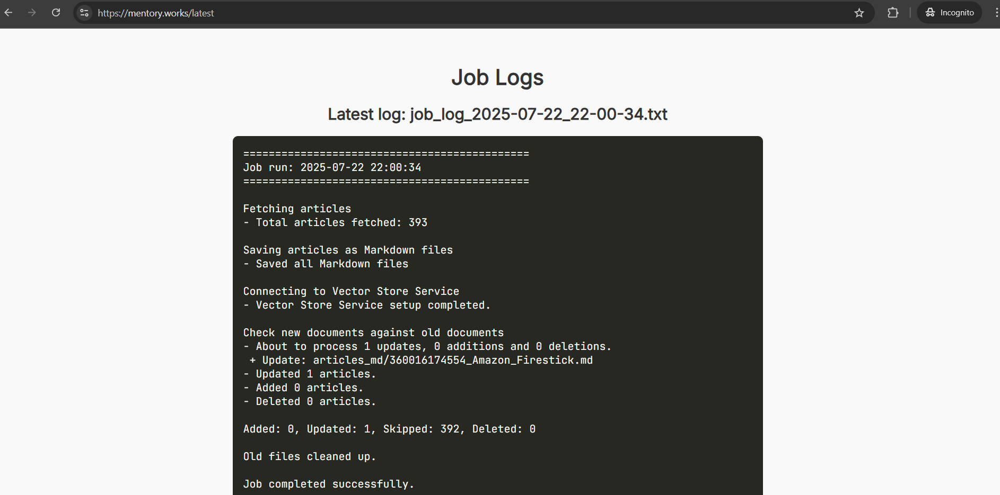
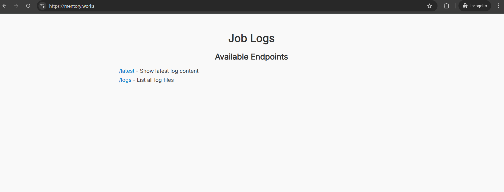
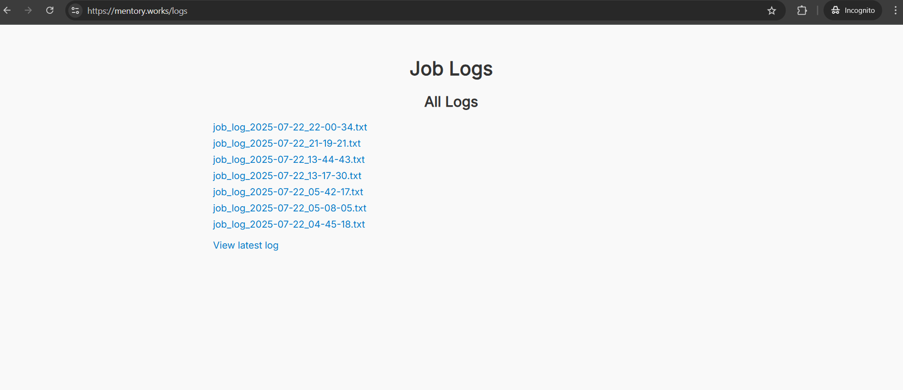

# Content Ingestion and Assistant Deployment Pipeline

> **This respsitory is still in development. More features will be added in the future.**


The current chunking strategy is max token length of 800 tokens and overlap of 400 tokens. Plans for more improved chunking strategy is implemented in `Real.ipynb` for future support with jsonl files comming from OpenAI.

The scraper is ran daily to keep the vector store up-to-date with the latest articles.

Check the logs at [https://mentory.works/latest/](https://mentory.works/latest/) to see the latest run and past runs.

## Setup

Clone the repository:

```bash
git clone https://github.com/PhKhang/contextual-assistant
cd contextual-assistant
cd src # for the source of the scraping and vector store upload
```

Create and activate a virtual environment (you can skip this step if you are using Docker):

```bash
python -m venv venv
source venv/bin/activate  # Windows: venv\Scripts\activate
pip install -r requirements.txt
```

Create a `.env` file based on `.env.sample`:

```env
OPENAI_API_KEY= # Your OpenAI API key
VECTOR_STORE_ID= # Your vector store ID
SUPABASE_URL= # Your Supabase URL i.e. https://...supabase.co
SUPABASE_KEY= # Your Supabase key
```

## How to run locally

Run the main script:

```bash
# In /src directory
python main.py
```

Or using Docker:

```bash
# In /src directory
docker build -t project .
docker run --rm -v $(pwd):/app -e OPENAI_API_KEY=sk-... -e VECTOR_STORE_ID=vs_... -e SUPABASE_URL=https://...  -e SUPABASE_KEY=eyJ... run-script main.py
# or (.env file is present)
docker build -t run-script . && docker run --rm -v $(pwd):/app run-script main.py
```

## Logging artefact server
Provides an interface to view the latest log and past logs.



```bash
cd artefact
fastapi dev server.py
# or
docker compose up
```

## Screenshot

Assistant's correct answer with citations to:
"How do I add a YouTube video?"


Artefact server log interface:


Latest log `/latest`:


All logs `/logs`:


## Testing notebook
You can test the scraping and vector store upload using the provided Jupyter notebook: `Real.ipynb`


## Deliverables

- Scraped and cleaned Markdown files in `articles_md/`
- Vector Store upload via API implemented in `main.py`
- Daily job deployment with Docker and scheduled job script
- Code clarity with no hard-coded keys (`.env.sample` provided)
