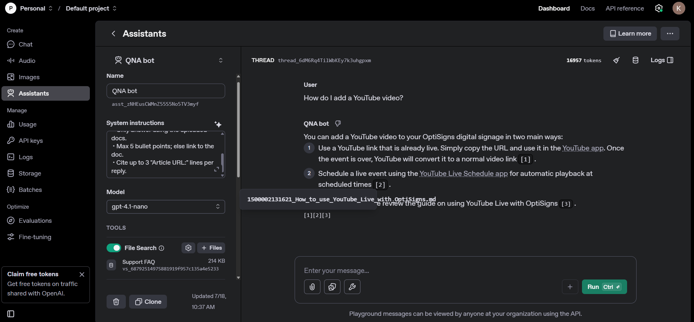

# Content Ingestion and Assistant Deployment Pipeline

> **This respsitory is still in development. More features will be added in the future.**

## Plans
- Custom chunking
 - from md to json/jsonl with each chunk having both the content and the nearest heading (along the other metadata) (need more LLM consultation)
 - file name metadata
- How to detect delta?
 - detect changes at md file level
 - detect changes at json/jsonl chunk level
 - where to store the before to compare with the after?
 scrape -> md files -> (chunking -> json ->) dict --hash()-> hash -> db
- Deployment
 - digital ocean cron + docker
 


## Setup

Clone the repository:

```bash
git clone https://github.com/yourusername/yourrepo.git
cd yourrepo
```

Create and activate a virtual environment:

```bash
python -m venv venv
source venv/bin/activate  # Windows: venv\Scripts\activate
pip install -r requirements.txt
```

Create a `.env` file based on `.env.sample`:

```env
OPENAI_API_KEY=your_api_key_here
```

## How to run locally

Run the main script:

```bash
python main.py
```

Or using Docker:

```bash
docker build -t project .
docker run -e OPENAI_API_KEY=your_api_key project
```

## Screenshot

See `docs/playground_screenshot.png` for Assistant's correct answer with citations to:

"How do I add a YouTube video?"

## Deliverables

- Scraped and cleaned Markdown files in `articles_md/`
- Vector Store upload via API implemented in `main.py`
- Daily job deployment with Docker and scheduled job script
- Code clarity with no hard-coded keys (`.env.sample` provided)
